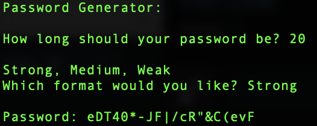

# Password Generator
- An terminal based password generator!

---

## Acknowledgments
- 'password_generator.py' Developed by [David OMullan](https://github.com/davidomullan)

## Software
Developed with [Python 3.9.10] (https://www.python.org/download/releases/3.0/)

## Execution
1. Open command line interface (i.e. Terminal for MacOS, Command Prompt for Windows)
3. Type 'python3 password_generator.py', and press enter or return.
4. Enter desired length of password (must be integer).
5. Enter desired strength of password (Strong, Medium, or Weak).
6. Your new password will be displayed!
